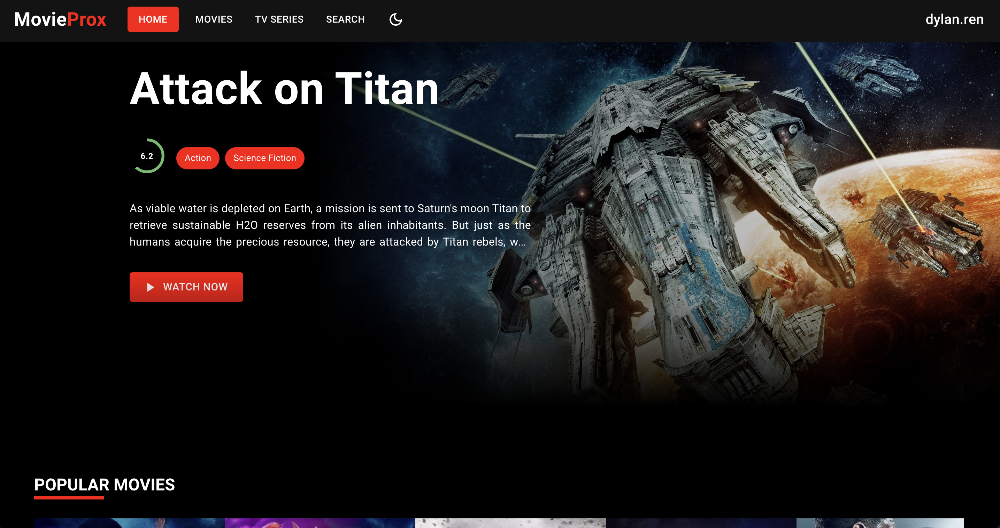
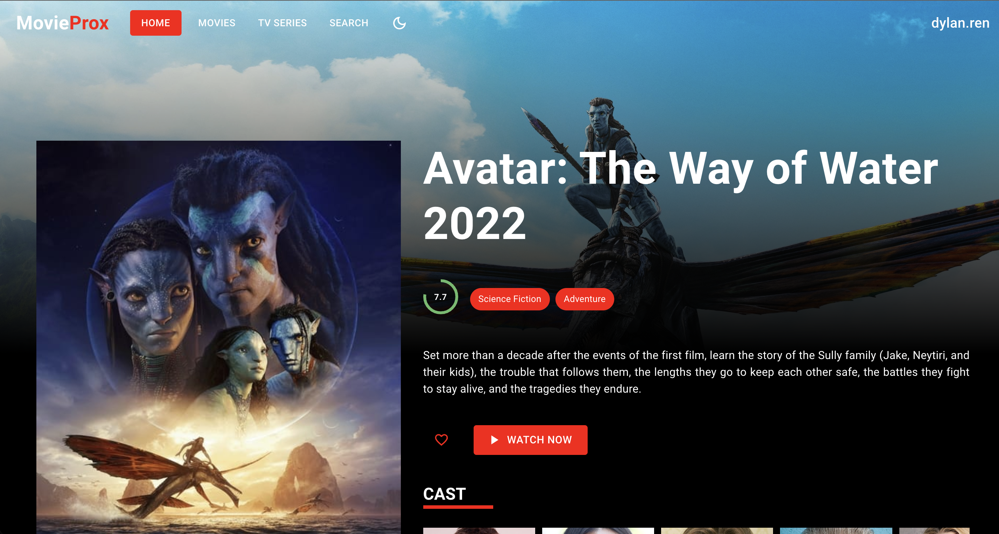

## MovieProx 
- A Fullstack Responsive Movie Website with MERN stack and Themoviedb API.
- Hosted with vercel at : https://movieprox.vercel.app/
What are the features of this project?

- Sign up / Sign in
- Save movie to Favorite list (Remove favorite item)
- Write review for movie (Delete review)
- Search movies / tv series / people
- Light / Dark theme

What are the technologies in this project?

- Front end
    - Create react app
    - Material UI
    - SwiperJS
    - React router v6
    - Formik
    - Yup
    - Axios
- Back end
    - Express rest api
    - Express validator 
    - Jsonwebtoken
    - Mongoose
    - Axios

# Screenshots

